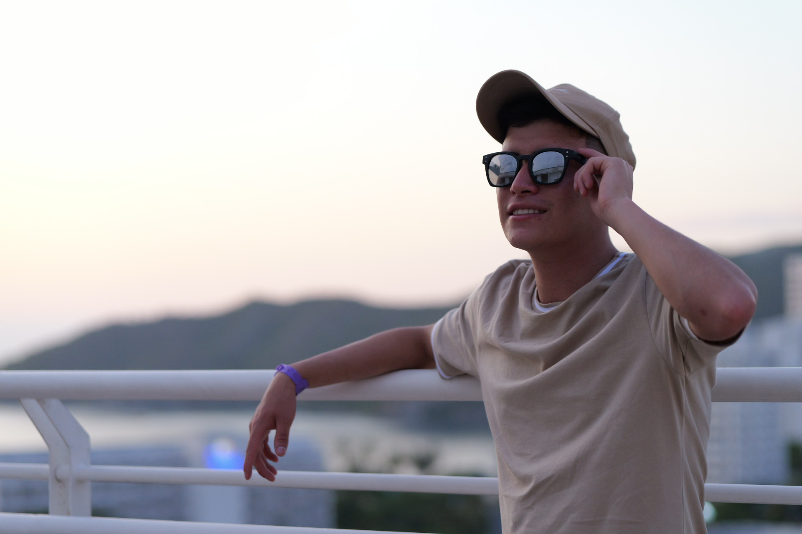
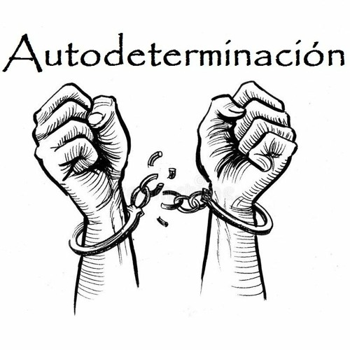

# InerciaZero
Gestión de deportes alternativos la motivación en la educación física
<!DOCTYPE html>
<html lang="es">
<head>
  <meta charset="UTF-8" />
  <meta name="viewport" content="width=device-width, initial-scale=1.0"/>
  <title>InerciaZero</title>
  
</head>
<body>
  <header>
    
    <h1>InerciaZero</h1>
    <h2>Gestión de Deportes Alternativos para una Autodeterminación</h2>
  </header>

    <h1>InerciaZero</h1>
    <h2>Gestión de Deportes Alternativos para una Autodeterminación</h2>
  </header>

  <section class="datos-personales">
    <h3>Diego Ortiz</h3>
    
Estudiante de Licenciatura en Educación Física en la Universidad Pedagógica Nacional de Colombia. Jugador de Ultimate Frisbee con más de 10 años de trayectoria. Representé a la Selección Colombia Sub17 en el año 2018. Me apasiona la creatividad, la innovación, la crítica constructiva, lo nuevo, las relaciones humanas y la competencia positiva.

    
  </section>

  

    <button onclick="mostrarSeccion('inicio')">Inicio</button>
    <button onclick="mostrarSeccion('deporte')">Deporte Escolar</button>
    <button onclick="mostrarSeccion('modelo')">Modelo Emancipador</button>
    <button onclick="mostrarSeccion('desarrollo')">Desarrollo a Escala Humana</button>
    <button onclick="mostrarSeccion('autodeterminacion')">Teoría de la Autodeterminación</button>
  

  <main>
    <section id="inicio" class="contenido visible">
      <h2>Inicio</h2>
      
<strong>InerciaZero</strong> no es solo un proyecto: es una invitación a repensar la educación física desde una mirada crítica, creativa y transformadora. Es un espacio que nace de la necesidad de romper con las prácticas tradicionales que limitan el potencial del movimiento humano, proponiendo en su lugar un enfoque donde la exploración, el juego y la autonomía sean protagonistas.

Creemos que los deportes alternativos no solo enriquecen la motricidad, sino que también son herramientas poderosas para el desarrollo personal y colectivo. Desde la Frisbee hasta el Kin-Ball, pasando por propuestas emergentes y autogestionadas, InerciaZero impulsa una educación física inclusiva, diversa y con sentido.

Nuestro objetivo es claro: construir experiencias motrices que despierten la curiosidad, el pensamiento crítico y el deseo de aprender desde el cuerpo. Aquí, cada estudiante es protagonista de su proceso, capaz de tomar decisiones, crear nuevas formas de jugar, y reflexionar sobre su lugar en el mundo a través del movimiento.

Con InerciaZero, la clase de educación física deja de ser un espacio repetitivo y se convierte en un laboratorio de posibilidades. Porque el cuerpo piensa, siente, se relaciona y transforma. Y cuando lo dejamos expresarse libremente, somos capaces de reinventar la educación.

      
    </section>

    <section id="deporte" class="contenido">
      <h2>Deporte Escolar</h2>
      <section id="deporte" class="contenido">
  <h2>Deporte Escolar</h2>
  <iframe src="https://gamma.app/embed/atux61lg8yfdzxy" style="width: 700px; max-width: 100%; height: 450px;" allowfullscreen title="El Deporte Escolar según Blázquez: Una Visión Integral"></iframe>
      
    </section>

      
    </section>

    <section id="modelo" class="contenido">
      <h2>Modelo Emancipador</h2>
      

        <iframe src="https://view.genially.com/680581182a864e6d9137ebad" style="position: absolute; top: 0; left: 0; width: 100%; height: 100%;" allowfullscreen></iframe>
      

      
    </section>

    <section id="desarrollo" class="contenido">
      <h2>Desarrollo a Escala Humana</h2>
      <iframe src="https://app.emaze.com/@ALFLFFWFF/desarrollo-a-escacla-humana" width="960" height="540" allowfullscreen></iframe>
      
    </section>

    <section id="autodeterminacion" class="contenido">
      <h2>Teoría de la Autodeterminación</h2>
      <iframe width="560" height="315" src="https://www.youtube.com/embed/CrhBdNYzC3E?si=fDlEi8xyCKZX6BJo" frameborder="0" allowfullscreen></iframe>
      
    </section>
  </main>

  <footer>
    
&copy; 2025 InerciaZero. Todos los derechos reservados.

  </footer>

  
</body>
</html>

